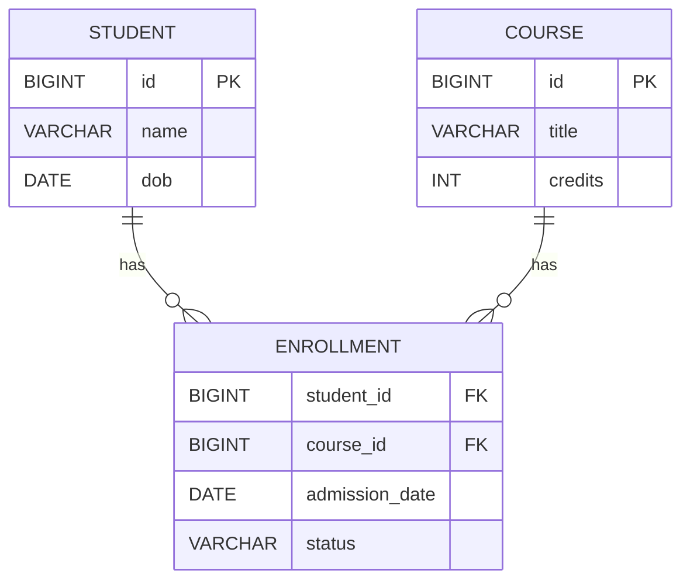

# Entity relation case study
## Scenario 1
We have a **Student** entity and a **Course** entity. Any number of students can be enrolled in any number of courses, i.e, **Student** and **Entity** has ManyToMany relationship.
<br/>We can model this relationship using 2 ways.
### 1. Without using a joining entity

```java
@Entity
public class Student {
    // TODO: declare other attributes

    @ManyToMany
    @JoinTable(
            name = "student_subject",
            joinColumns = @JoinColumn(name = "student_id"),
            inverseJoinColumns = @JoinColumn(name = "subject_id")
    )
    private List<Subject> courses;
}
```
## 2. Using joining entity

```java
import jakarta.persistence.Entity;

@Entity
public class Enrollment {
    private Student;
    private Course;
}
```
## ER Diagram
